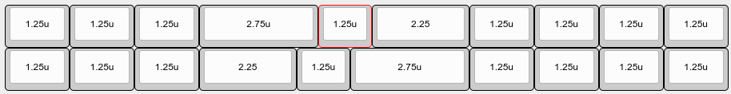
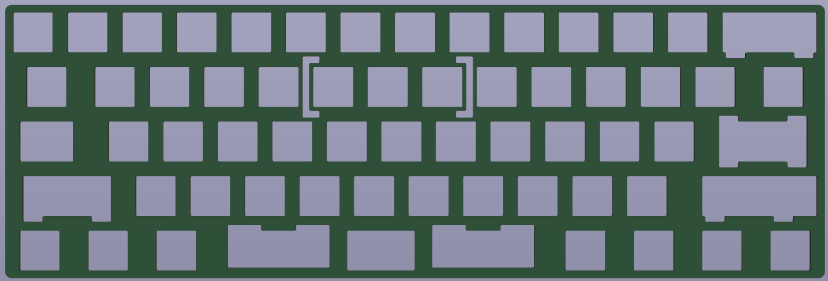

# Bakeneko 60 split spacebar

This repo forks the original [Bakeneko 60 PCB and plate](https://github.com/kkatano/bakeneko-60) adding support for a split spacebar based on the bottom row of the [DZ60 PCB](https://kbdfans.com/products/dz60-60-pcb).

### Layouts

### Plate

### Resources

See the [original repo](https://github.com/kkatano/bakeneko-60) for all additional resources
